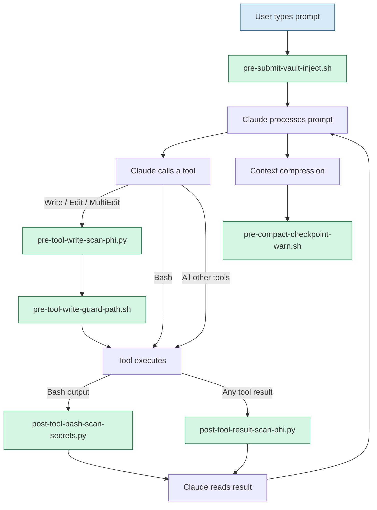
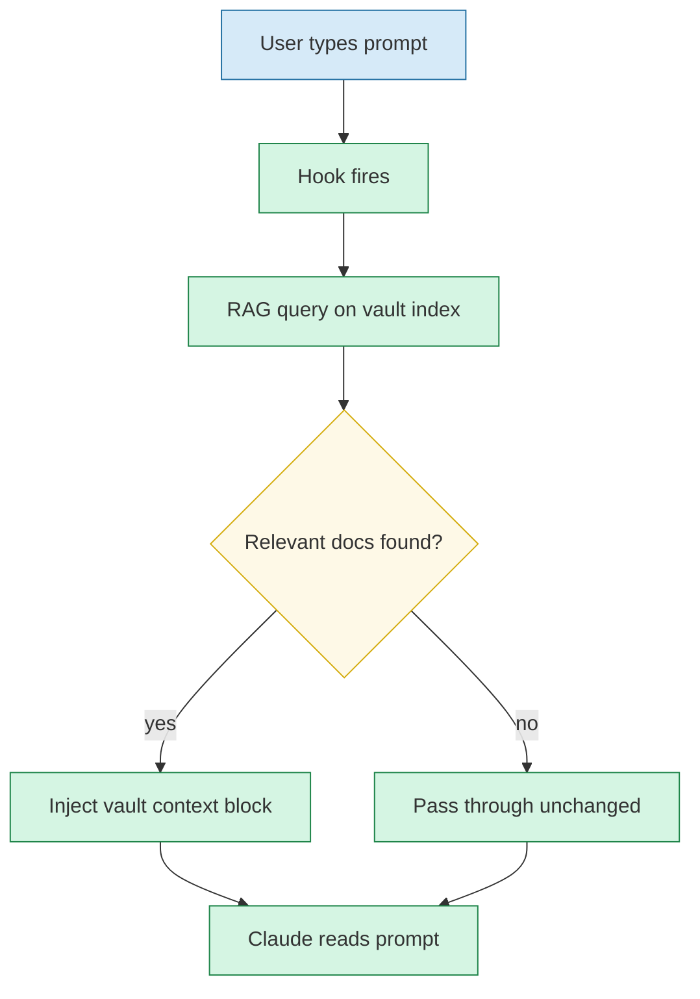
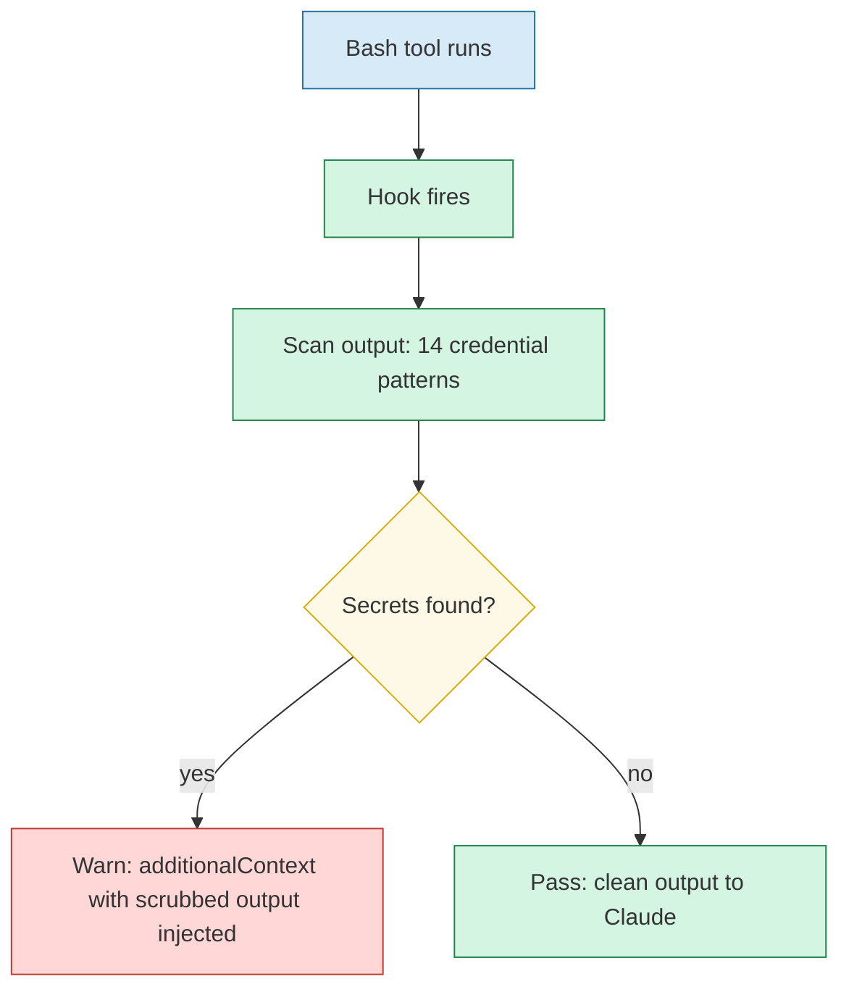
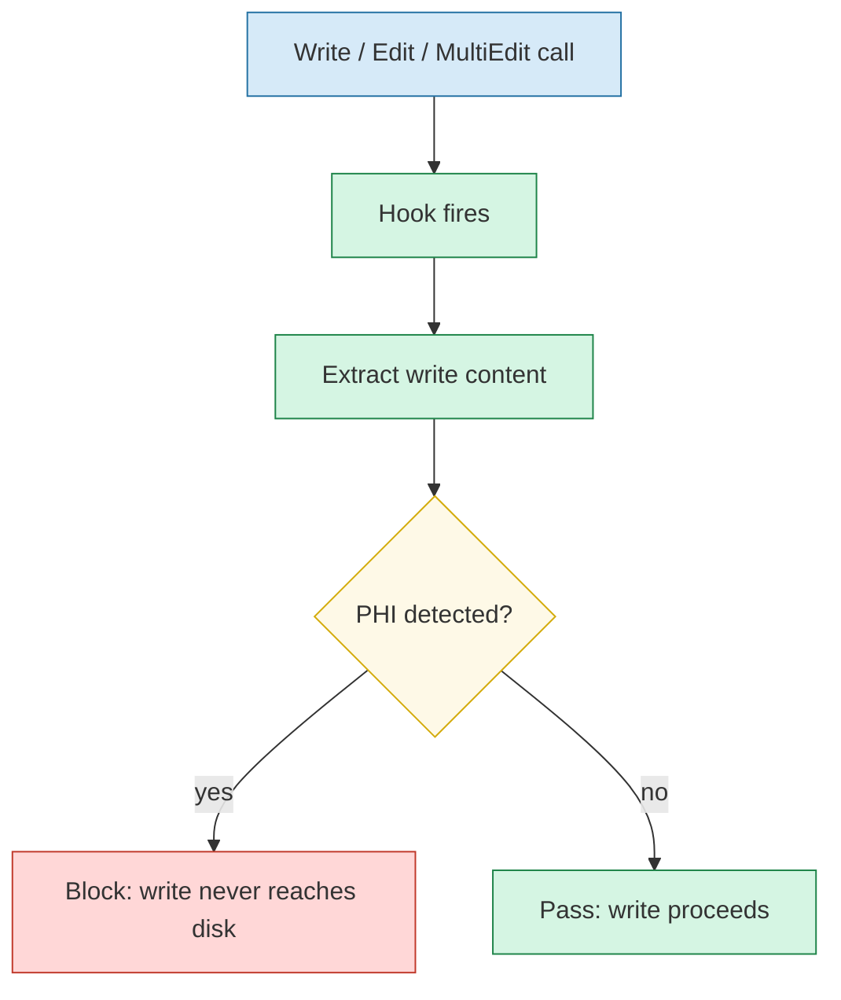
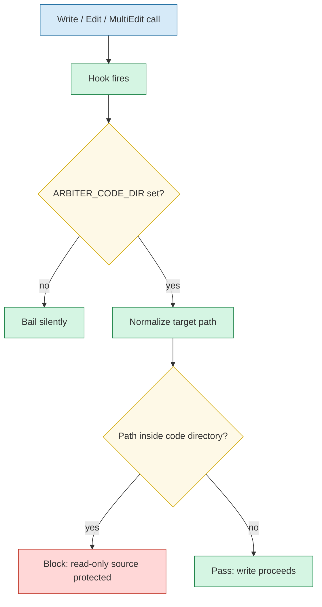
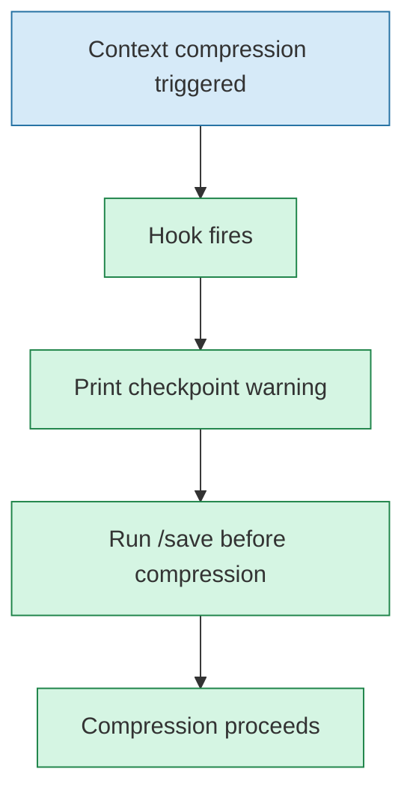
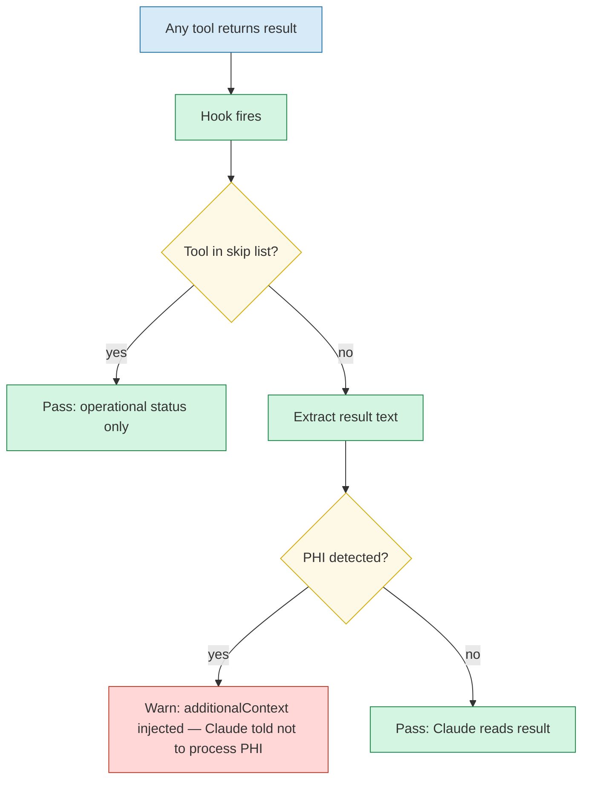

# Hook Reference

Created by Dipen Patel.

Claude Code hooks are shell or Python scripts that fire at defined points in the agent loop. Arbiter uses six hooks across four events. Each section below shows what the hook does and when it fires.

Hooks are defined in the repo `settings.json` and installed globally to `~/.claude/settings.json` with absolute paths. Install re-wires them automatically on every run.

---

## Hook event map



---

## 1. pre-submit-vault-inject.sh

**Event:** UserPromptSubmit — fires before every prompt reaches Claude.

Queries the vault RAG index and injects matching document excerpts into the conversation. Claude reads your vault context without you pasting it manually.



**Path portability:** The script derives its own location from `BASH_SOURCE[0]` so it works after the dotfiles directory is renamed or moved.

---

## 2. post-tool-bash-scan-secrets.py

**Event:** PostToolUse — fires after every Bash tool call.

Scans command output for credentials. When a match is found the hook injects an `additionalContext` warning into Claude's turn with a scrubbed version of the output. **PostToolUse hooks cannot suppress a result from reaching Claude** — the raw output and the warning both reach Claude. The hook instructs Claude not to act on raw credential values.

> **Limitation:** Secrets in Bash output reach Claude's context. The hook reduces the risk that Claude will reproduce or forward them, but does not eliminate it.



**Patterns covered:** Anthropic key, AWS access key, Jira token, Databricks PAT, GitHub PAT, GitHub token, Slack token, OpenAI key, Azure storage key, Azure SAS, PEM private key, auth header, credential assignment, exported env secret.

---

## 3. pre-tool-write-scan-phi.py

**Event:** PreToolUse — fires before Write, Edit, and MultiEdit.

Scans the content being written to disk for PHI patterns. The write is blocked before it reaches disk if a match is found.



**Patterns covered:** MRN, SSN, DOB, patient ID, NPI, insurance ID.

---

## 4. pre-tool-write-guard-path.sh

**Event:** PreToolUse — fires before Write, Edit, and MultiEdit.

Blocks writes to the read-only code directory (`ARBITER_CODE_DIR`). That directory is a RAG source mirror of production repos and must never be written to. If `ARBITER_CODE_DIR` is not set the hook bails silently.



**False positive guard:** Path comparison uses a trailing slash on both sides (`/code/` vs `/codebackup/`) so a directory whose name starts with the code dir name does not trigger a false block.

---

## 5. pre-compact-checkpoint-warn.sh

**Event:** PreCompact — fires before Claude Code compresses the context window.

Writes a checkpoint reminder to Claude Code's debug log before compaction fires. **This output does not reach Claude's context or the user's terminal.** PreCompact stdout goes to the debug log only; the feature request to allow PreCompact to inject into Claude's context (GitHub #43733) was closed as "not planned." The only user-visible PreCompact signal is `exit 2` with stderr output, which hard-blocks compaction entirely.

> **Current status: this hook is a functional no-op.** The warning reaches no one. If you want to preserve state across compaction, use `SessionStart` with an injected summary file written by a PreCompact side-effect instead.



---

## 6. post-tool-result-scan-phi.py

**Event:** PostToolUse — fires after every tool call (empty matcher).

Scans every tool result for PHI before Claude reads it. Covers Bash (Databricks CLI, git), Read (files), and all MCP tools (Jira, Notion, Slack, Databricks, any future connection). Write, Edit, MultiEdit, and TodoWrite are skipped because they return operational status, not external data.

**PostToolUse hooks cannot suppress results.** When PHI is detected, the hook injects an `additionalContext` warning instructing Claude not to process, store, log, or forward the data. The raw result still reaches Claude.

> **Limitation:** PHI in tool results reaches Claude's context. The hook instructs Claude to halt processing, but does not technically prevent the data from being seen.



**Skip list:** Write, Edit, MultiEdit, TodoWrite.

**Patterns covered:** MRN, SSN, DOB, patient ID, NPI, insurance ID.

**Why this is the critical gate:** MCP tools are the primary channel through which production data enters Claude's context. A Databricks query, a Jira issue, or a Notion page can all return PHI. This hook intercepts at the seam between external systems and Claude's context window, which is the last point before data enters the Anthropic API request body.

---

## PHI scrubbing: what it covers and what it does not

The PHI hooks use pattern matching on structured identifiers. They catch formatted data — an MRN written as `MRN: 1234567`, a date preceded by a DOB keyword. They do not read intent. They do not catch free-text clinical narrative.

### What the hooks catch

All four surfaces below are scanned before the data reaches Claude or Anthropic.

| Surface | Hook | Example caught |
|---|---|---|
| File content being written to disk | `pre-tool-write-scan-phi.py` | Write call containing `MRN: 9876543` |
| Bash command output | `post-tool-result-scan-phi.py` | Databricks CLI returning a row with `patient_id: 84729` |
| File content being read | `post-tool-result-scan-phi.py` | Read call returning a CSV with `SSN: 123-45-6789` |
| MCP tool result (Jira, Notion, Slack, Databricks) | `post-tool-result-scan-phi.py` | Jira issue body containing `DOB: 03/15/1982` |

**Structured patterns the hooks detect:**

| Identifier | Example that triggers a block |
|---|---|
| MRN | `MRN: 1234567`, `MRN#9876543`, `MRN 0045221` |
| SSN | `SSN: 123-45-6789`, `SSN 123-45-6789`, `SSN on file: 123-45-6789` — requires `SSN` or `social security` keyword; bare digits alone are not caught |
| Date of birth | `DOB: 03/15/1982`, `date of birth: 1/5/80`, `born: 12/31/1975` |
| Patient or member ID | `patient_id: 84729`, `member id: 00234`, `pt id: 9922` |
| NPI | `NPI: 1234567890` |
| Insurance or policy ID | `insurance_id: ABC123456`, `policy_number: XY-99001`, `subscriber_id: Z889900` |

### What the hooks do not catch

**1. User-typed PHI in the chat prompt.**
If you paste a patient record directly into the chat, that text goes to Anthropic before any hook can intercept it. No hook scans what you type — only what tools return.

What to avoid:
```
❌ "Here is the patient record: MRN 1234567, DOB 03/15/1982, SSN 123-45-6789. Help me debug this."
```

What to do instead:
```
✅ "The TAVR encounter record is missing encounter_date. 14 of 500 records have this issue. Help me debug the null check."
```

**2. Free-text clinical narrative.**
The hooks scan for structured identifiers with recognizable labels. A patient name, a street address, or a clinical note written in plain prose will not trigger a block.

What slips through:
```
❌ "John Smith, admitted March 15, lives at 123 Main Street" — no structured identifier, no block
❌ "The patient presented with chest pain on 3/15" — date without a DOB/born keyword, no block
```

What gets caught:
```
✅ "DOB: 03/15/1982" — DOB keyword + date format → blocked
✅ "MRN 1234567" — MRN label + digits → blocked
```

**3. PHI already in the conversation from an earlier turn.**
If PHI entered Claude's context before a hook was active — for example, from a prompt you typed before the hook was installed — it remains in the conversation history that Anthropic receives on every subsequent turn. Hooks only gate new data as it enters; they do not scrub existing context.

**4. PHI in images or screenshots.**
Claude can read images. PHI visible in a screenshot of a patient dashboard or a lab report is not scanned by any hook.

### The rule that no hook can replace

Do not paste patient-level data into the chat. Work at the aggregate level.

| Instead of | Use |
|---|---|
| A query result showing individual rows with MRNs | A row count: "14 of 500 records failed" |
| A specific patient's record as an example | An anonymized example with the field names and value types, not real values |
| A real MRN in a bug report | A placeholder: `MRN: XXXXXXX` |
| A full encounter record in a Jira comment | The encounter type and the field that failed: "TAVR, encounter_date: NULL" |

The hooks are a defense layer, not a replacement for data hygiene. They catch mistakes. Your judgment prevents them.


---

## Adding a new hook

1. Write the script in `hooks/` following the five-field header: Trigger / Scope / Action / On result / If filter.
2. Add an entry to the repo `settings.json` under the matching event key, then re-run `install.sh`.
3. Add fixture tests in `tests/hooks/fixtures/{hook-name}/` and update `tests/hooks/run.sh`.
4. Add a manual wiring test to `tests/hooks/e2e-wiring-checklist.md`.
5. Update this file with the new section and diagram.

For the header format and naming convention see `docs/structure.md`.
